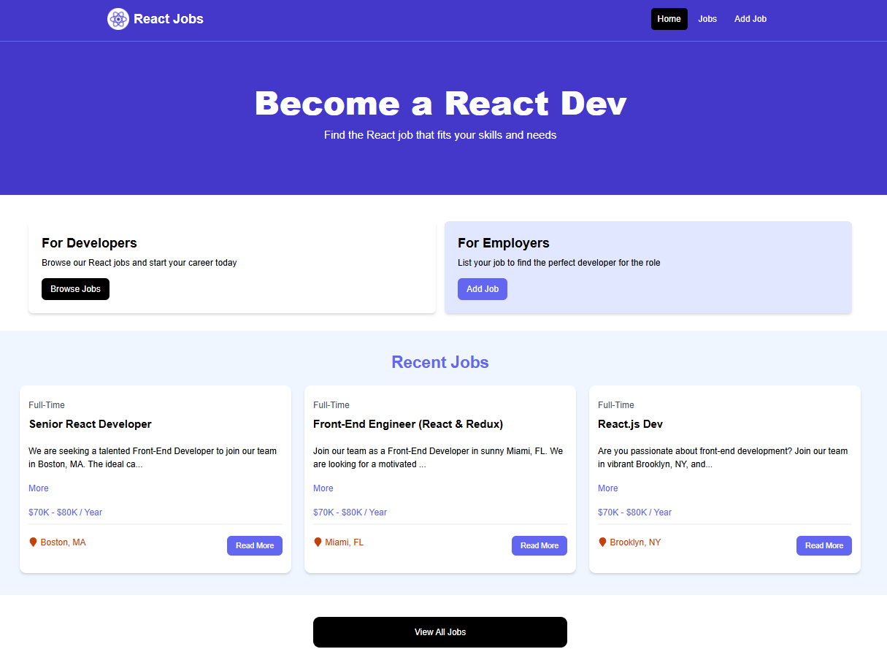

# Projeto Jobs - React + Vite

Este é um projeto de aplicação web para visualização e postagem de vagas de trabalho. Desenvolvido com React + Vite



> [!NOTE]
> A `branch main` usa Server Json e possui o CRUD funcional, enquanto a `branch hosting` possui um .json estático para hospedar na vercel com os dados mockados
> Site online: https://projeto-jobs.vercel.app/

## Tecnologias Utilizadas

- **React** (v18.3.1)
- **Vite** (v5.3.1)
- **React Router Dom** (v6.24.1)
- **TailwindCSS** (v3.4.4)
- **React Icons**, **React Spinners** , **React Toastify**
- **JSON Server** (para simular um banco de dados)

---

## Recursos

- Interface para visualização de vagas.
- Simulação de backend com JSON Server.
- Integração de bibliotecas para estilização e componentes adicionais.
- Navegação entre páginas utilizando React Router.

---

## Requisitos

- Node.js instalado ([download aqui](https://nodejs.org/)).
- (Opcional) Extensão **React Developer Tools** para inspeção no navegador ([instale aqui](https://chrome.google.com/webstore/detail/react-developer-tools/fmkadmapgofadopljbjfkapdkoienihi)).

---

## Passo a Passo para Rodar o Projeto

1. Clone o repositório:

   ```bash
   git clone https://github.com/dev-jonathan/projeto-jobs.git
   cd projeto-jobs
   ```

2. Instale as dependências:

   ```bash
   npm install
   ```

3. Execute o servidor local para simular um backend:

   ```bash
   npm run server
   ```

   O servidor estará disponível em: [http://localhost:8000](http://localhost:8000).

4. Inicie o projeto em modo de desenvolvimento:
   ```bash
   npm run dev
   ```
   O projeto estará disponível em: [http://localhost:5173](http://localhost:5173).

---

## Observações

Não há integração com um banco de dados hospedado ou funcionalidades avançadas de backend. Tudo é simulado localmente com o JSON Server. Foi inspirado nesse [curso](https://www.youtube.com/watch?v=LDB4uaJ87e0).
